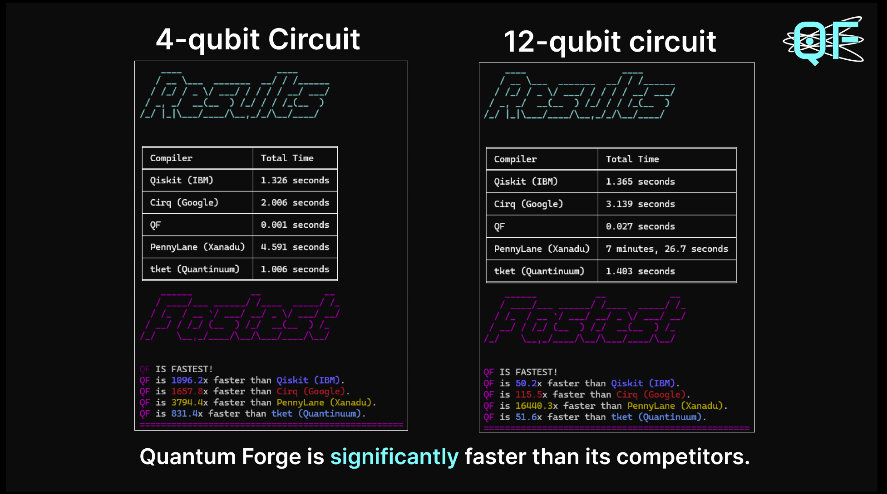

# Qitara


[](https://github.com/Daksh-Shami/Qitara/actions/workflows/ci.yml)

A high-performance Quantum simulation & visualization framework built in Rust, designed for efficient quantum circuit execution and analysis using intuitive UIs.

## Feature Set for First Release (Alpha)

- **Compiler Core w/ OpenQASM 3.0 Support**: Complete parser and lexer with AST generation
- **Planned: JIT Compiler**: Architecture ready for Cranelift-based real-time execution (coming soon)
- **High-Performance CPU Simulation**: Rust backend for small-to-medium circuits
- **Planned: Interactive UI with Tauri**: Tauri framework integration started, UI skeleton in progress
- **Modular Architecture**: Built with extensibility in mind for future tooling and hardware backend support

## Project Status

Qitara is currently in **alpha development**. Core components like parsing, AST generation, and simulation backend are complete. Tauri-based UI and Cranelift-based JIT backend are in early stages.

See our [project milestones](../../milestones) for the development roadmap.

### ✅ Completed
- OpenQASM 3 Parsing & AST Processing
- Basic CPU-based Simulation Backend

### 🚧 In Progress
- Intermediate Representation (IR) Development
- Interactive Circuit Builder UI
- Benchmarking Suite


## Getting Started

### Prerequisites

- Rust
- Command Line/Terminal

### Installation

#### Clone the repository
```bash
git clone https://github.com/Daksh-Shami/Qitara.git && cd Qitara
```

#### Install Linux Dependencies (not required for Windows)

If you're developing on Linux, you'll need to install additional system dependencies for Tauri:

**Ubuntu/Debian:**
```bash
sudo apt-get update
sudo apt-get install -y libgtk-3-dev libsoup-3.0-dev libjavascriptcoregtk-4.1-dev webkit2gtk-4.1
```

**Fedora:**
```bash
sudo dnf install webkit2gtk3-devel gtk3-devel libsoup-devel
```

**Arch Linux:**
```bash
sudo pacman -S webkit2gtk gtk3 libsoup
```

### Build the project
```bash
cargo build --release
```
> ⚠️ **WARNING (for Windows):**  
> If your `cargo build` fails and you are on Windows, try running it again in **Developer PowerShell for VS Code 2022**.  
> If you don't have it installed, please install **Visual Studio 2022** first.

### Run tests
```bash
cargo test
```

### (Advanced, optional) Run benchmarks (vs. previous run of QF-compiler)
```bash
cargo bench
```
> This option is great for testing the effect of your changes. Whenever you made a change you think should improve the latency a lot, just run `cargo bench` and it will show you how much the performance improved relative to when you started. Key is **you should run this both before AND after making changes**.


### Basic Usage

Qitara provides a clean, intuitive API for building and simulating quantum circuits. Here's a simple example to create a Bell state:

```rust
use qf_compiler::{
    QuantumCircuit, // Core structs
    QuantumState,
    cnot, // Gates
    hadamard,
};

fn main() -> Result<(), String> {
    // Define circuit parameters
    let num_qubits = 2;
    let shots = 1000; // Number of measurement simulations
    
    // Create an empty quantum circuit
    let mut circuit = QuantumCircuit::new(num_qubits);
    
    // Add gates programmatically
    circuit.add_gate(hadamard(0));  // Apply Hadamard to qubit 0
    circuit.add_gate(cnot(0, 1));   // Apply CNOT with control qubit 0, target qubit 1
    
    // Simulation and measurement
    let initial_state = QuantumState::new(num_qubits);
    let final_state = circuit.apply_to_state(&initial_state)?;
    
    // Measure and print results
    println!("{}", final_state.measure(shots));
    // Expect states '00' and '11' with roughly equal probability
    
    Ok(())
}
```

### Examples

Qitara includes pre-built examples to help you get started:

1. **Bell State** - A simple entanglement example:
   ```bash
   cargo run --release --example bell_state
   ```
2. **Quantum Fourier Transform (QFT)** - Implementation of the fundamental QFT algorithm:
   ```bash
   cargo run --release --example qft
   ```
Run these examples to see Qitara in action and as a starting point for your own quantum algorithms.

## Performance

Qitara aims to provide superior performance for small-to-medium scale quantum circuit simulations. Initial benchmarks show promising results against existing frameworks:



*Note: These are preliminary benchmarks for just demonstration, and will be expanded in future releases. Qitara was previously called Quantum Forge in pre-alpha phase.*

## Roadmap

See our [GitHub Milestones](../../milestones) for detailed development plans.

## Contributing

Contributions are welcome. Please review the [contributing guidelines](CONTRIBUTING.md) before getting started.

### Getting Involved

- Check our [issues labeled "good first issue"](../../issues?q=is%3Aissue+is%3Aopen+label%3A%22good+first+issue%22) to get started.
- See our [help wanted issues](../../issues?q=is%3Aissue+is%3Aopen+label%3A%22help+wanted%22) for more challenging tasks.

## License

This project is licensed under the Apache 2.0 License - see the [LICENSE](LICENSE) file for details.

## Acknowledgments

- The quantum computing open source community, especially IBM for their OpenQASM language
- All contributors and supporters of this project

---

*Qitara is not affiliated with any commercial quantum computing provider.*
